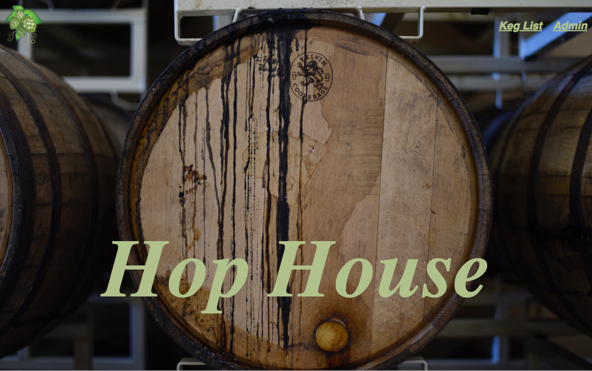
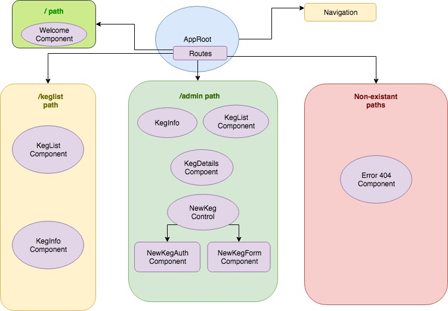

# Tap Room

#### Epicodus React wk1 Independent Project, 09/07/2018

#### By Devin Mounts

## A web application that allows patrons to view the taproom selection, and allows authorized users to add, edit and delete entries.  This React project is a recreation of a similar Angular application.
## Splash

## Component Structure

## Specs

| Behavior | Input | Output |
|----------|-------|--------|
| Program displays a list of available kegs with information on name, brand, price and alcohol content | N/A| Keg List |
| Program allows employees to complete a form and add a keg to list of kegs | GingerBeer, Devin's Brews, $5, .05 ABV | GingerBeer & info is added to Keg List |
| Program allows employees to edit keg information | GingerBeer, Devin's Brews, $7, .05 ABV | GingerBeer & info is updated on Keg List |
| Program allows patrons and employees to view remaining pints in keg | N/A | Ginger Beer: 120 pints remaining |
| Program allows employees to sell a pint, decreasing # of pints remaining | "Sell Pint" | Ginger Beer: 119 pints remaining |
|Program allows employees to see kegs with less than 10 pints remaining| N/A  | Ginger Beer: 9 pints remaining |

## Setup on OSX

* Install Node.js
* Clone the repo
* Create a `.eslintrc.json` file with desired rules.
* Create a `.gitignore` file and include: `.DS_STORE, node_modules, build.`
* `npm install` to install dependencies
* `webpack-dev-server` to build and start the dev server
* `npm run lint` to explicitly run ESLint
* `npm run test` to run the unit tests with

## Contribution Requirements

1. Clone the repo
1. Make a new branch
1. Commit and push your changes
1. Create a PR

## Technologies Used

* JavaScript
* Node.js
* React
* Bootstrap 4.1.3
* Babel
* Webpack
* ESLint
* Jasmine
* Karma

## Links

* Repo: https://github.com/devinmounts/taproom-react

## Notes

* Displaying dynamic data.
* Best practice for locating logic.

## License

This software is licensed under the MIT license.

Copyright (c) 2018 **Devin Mounts**
